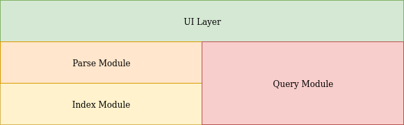
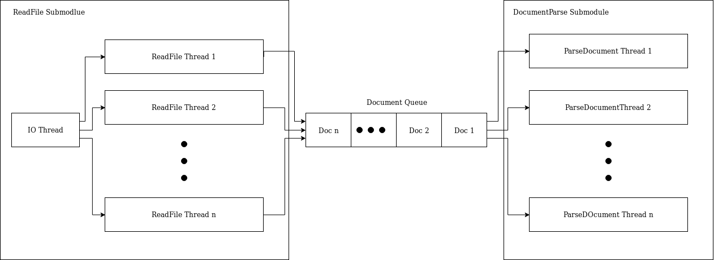
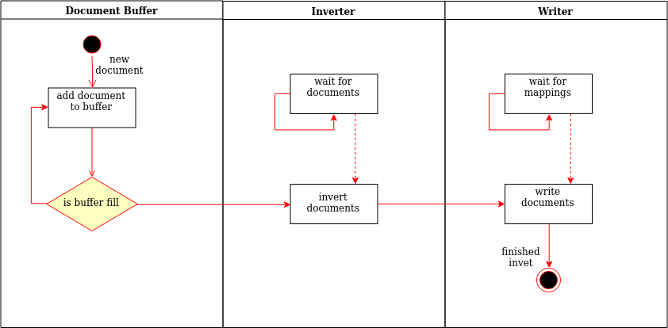

# Scobo-Engine Architecture

Scobo can be divided into four modules - three core modules and a UI modules, these modules have a mostly hierarchical relationship and thus we will look at them as layers.

The core modules are **Parse**, **Index**, **Query**, where the first two modules are separate as they are used in the initial setup of the engine in order to create the necessary data to later be searched, and the Query module is used to search the data and retrieve results. finally the **UI module** is used to facilitate user communication with the other layers.

## Parse Module

The Parse module receives the path to the corpus as input and is responsible for creating all document to termList maps that will later be used for indexing.

The Parse module is divided into two main parts, the first is the ReadFile submodule that is responsible for asynchronously taking multiple files from the corpus and splitting them up into documents these documents are then sent to the DocumentParse submodule that takes a document and finds all the terms appearing in it and creates `<document, termList>` mappings. (below is an abstract representation of the process)

## Index Module

The Index module receives the mappings created by the Parse module and  converts them into an inverted index mapping terms to a list of documents they appear in, this process is done in two phases:

* **Invert Phase**: first a batch of documents is taken from the parser and then is inverted into into term -> document mappings and then those mappings are written into a single posting file.
* **Merge Phase**: after all the documents have been inverted they are all merged into a single
   inverted file where each line is a term -> documents mapping

In addition to the inversion process the index module is tasked with the semantic analysis of the corpus, since implementing a full semantic analysis algorithm is beyond the scope of this project, the index module uses a prebuilt  map of words -> similar words based on the GloVe project, the process of creating said map from the GloVe project is described below.

### Invert Phase

The invert phase starts once the parser is finished with the first document, the document is inserted into the document buffer, once the document buffer fills up it sends all of its documents to be inverted and then continues collecting new documents.

When a group of document arrives to be inverted, they are converted from `<document, termList>`mappings into `<term, documentList>` mappings and then are sent to be written into a new posting file. In the process of inverting the the documents a dictionary and a document map are created, 
the dictionary holds mappings from terms to their statistics and a pointer to the terms posting (is null at this stage), the document map holds mappings from document ids (generated by the mapper) to the documents data, such as document name, max term frequency and length.

The mappings are written to a file sorted alphabetically by the term string, such that each mapping is written in a new line with its document list. (below is an abstract representation of the process)

### Merge Phase

When all documents have been written into posting files, the indexer initiates a merge, during the merge all the posting files are read concurrently line by line. In each iteration we check to see which is the alphabetically minimal term in all the lines, then we merge all the lines containing said term and write the merged line into the inverted file, at this point the dictionary pointer is updated to point to the new line written to the inverted file.

### Semantic Analysis

As mentioned above a map of word -> similar words is used for semantic improvement of the queries, this map was created from the GloVe project in the following process:

1. The GloVe file consists of words -> vector mappings where each entry in the vector represents the words similarity to some concept. The following is done on the smallest provided GloVe file.
   * first clean the file of all non words and convert all the capitalized words to lower case.
   * create a new file where all the words are stemmed and if two or more words have the same stem the stems vector will be the average of all the vectors of the unstemmed words.
   * run a similarity function between each word and all the other words (we used simple cosine similarity),  save the 10 words with the heights similarity for each word.
2. Since running the above process for the larger GloVe files would take too ling we ran a similar process with an added step for cleaning, we took a dictionary of English words form GitHub - https://github.com/dwyl/english-words/blob/master/words_alpha.txtand in the cleaning step we removed all words that do not appear in the English dictionary, this produced a much smaller file after the clean step on which we ran the reset of the steps described in step 1.
3. Now we have 4 files, two files generated from the small GloVe and two from the big GloVe, lastly we merged the files to produce two files, one stemmed and one unstemmed, for the merge we simply took the union of both files and for any intersection we replaced the entry from the file generated from the small GloVe by the one generated from the big GloVe (this because presumably the similarity generated from the bigger GloVe file is more generally accurate since the data set is much bigger)

Now we have two maps of word -> similar words, one for stemmed words and one for unstemmed words, when the parser finishes its work and all the words from the corpus are present in the dictionary, we will load the appropriate file (depending on if the user chose to run the engine with stemming or not) and compare it with the dictionary we created, we will then save a smaller file containing only words found in the dictionary, though the words in the similarity vector might still not be available in the dictionary, those words will simply be ignored in the query analysis.

## Query Module

The Query Module is ran independently of the parse and index modules, though it uses their output - the inverted index in order to process queries and return documents quickly. The Query Module receives a query and returns a list of documents that are most relevant to the query.

The Query processing in split into three stages:

* Parsing - the query is treated as a document and the parser is ran on it in order to find all the terms preset in the query.
* Retrieval - all the documents that might be relevant to the terms in the query (the documents in the term's posting) are collected.
* Ranking - the retrieved documents are scored based on the BM25 similarity function and only the most relevant documents are then returned in order of relevance.  we use two similarity function, one semantic and the bm25 function itself.
  * bm25 - the function iterates all terms in the intersection between the query and a given document, and uses weights (k, b) that we chose by trial and error, and normalization factors like the terms document frequency, number of documents in the corpus, and the average document length to achieve a similarity measure between the query an the document.
  * semantic - for semantic ranking we added semantic fields to the query, an then created a measure that is a weighted average of the similarity between parts of the query and parts of the document, more precisely we calculated the bm25 measure between only the entities, then only the terms, then only the semantic fields, then only numbers, and then averaged the results using weights for each semantic part of the query, the weights given to numbers and semantic fields is 0.1 as they are less indicative of the topic of the query, and 0.4 to the entities and terms as they give a better indication for the topic of the query.  